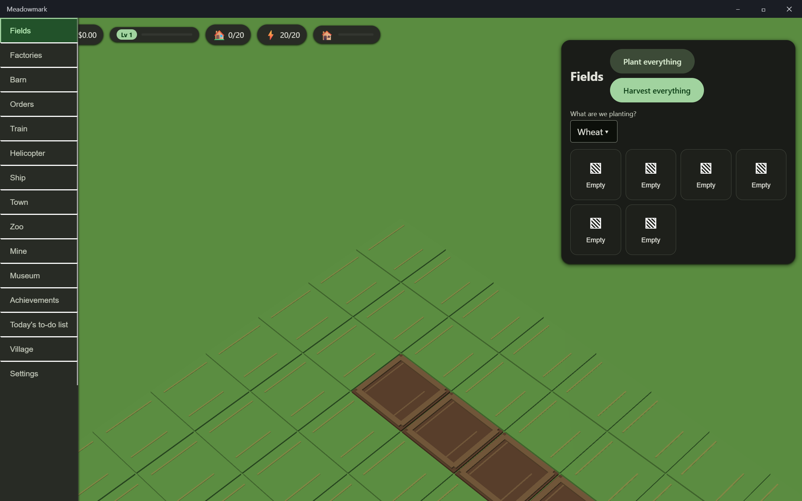

# Meadowmark

A 3D town-and-farm building game for Windows. Grow crops, run a farm,
produce and deliver goods, and grow a town — a Township-style building
game rendered in three.js inside an Electron desktop app, with a Material
Design 3 UI.

Meadowmark is **free**, with **no purchases of any kind** — no premium
currency, no unlocks, no subscriptions, ever. It is also **unsigned**:
this project permanently does not use code signing, so Windows will show
an "unknown publisher" / SmartScreen warning when you run the installer.
That warning is expected, not a bug.

- Repository: [Ding-Ding-Projects/meadowmark](https://github.com/Ding-Ding-Projects/meadowmark)
- Website: [Meadowmark documentation and landing site](https://ding-ding-projects.github.io/meadowmark/)
- Documentation: [`docs/README.md`](docs/README.md)
- Platform: Windows only
- License: MIT

## Install

Download the latest `Meadowmark-Setup-*.exe` from the
[Releases](https://github.com/Ding-Ding-Projects/meadowmark/releases) page
and run it. Windows will warn that the publisher is unknown — click
"More info" → "Run anyway". Nothing in Meadowmark asks for payment, ever.

## Contents

- [Building from source](#building-from-source)
- [Runtime evidence](#runtime-evidence)
- [Published baseline](#published-baseline)
- [Project layout](#project-layout)
- [Line count](#line-count)
- [Contributing](#contributing)

## Building from source

<details>
<summary>One-click scripts (recommended)</summary>

Run these from the repository root. Each one bootstraps every dependency
it needs — Node.js, npm packages — on a machine that has nothing
installed, with no manual steps required.

- **`build.bat`** — builds every workspace, then (interactively) offers to
  run the app.
- **`build-installer.bat`** — builds the real, unsigned Squirrel.Windows
  installer, verifies it exists at a plausible size, and prints its path
  and SHA-256.
- **`download-dependencies.bat`** — just the dependency bootstrap step, if
  you want to run the rest yourself.

All three accept `/s`, `--silent`, or a `SILENT=1` environment variable
for fully non-interactive operation and exit non-zero on the first real
failure. The current release workflow calls only
`download-dependencies.bat /s`; it then invokes the npm build and packaging
commands directly, so CI does not yet prove the other two root scripts.

</details>

<details>
<summary>Manual steps</summary>

```
npm install
npm run build
npm run start
```

To produce the installer yourself:

```
npm run dist
```

This runs `electron-builder --win squirrel`, producing an **unsigned**
`Setup.exe`, `RELEASES` file, and `.nupkg` under `release/`. Code signing
is permanently disabled for this project — see `electron-builder.yml`.

</details>

<details>
<summary>Requirements</summary>

- Windows 10 or later
- Node.js 20+ (the one-click scripts install this for you)

</details>

## Runtime evidence

The published `v0.1.0-22` Squirrel.Windows package was extracted and launched
on a hidden desktop from commit
[`dd2a44f`](https://github.com/Ding-Ding-Projects/meadowmark/commit/dd2a44fa5264656a62802af04cac3bd192668b9d).
This capture proves packaged launch and first paint: terrain tiles, field beds,
the readable Wheat selector, the navigation rail, and the HUD are visible in
that artifact. It does **not**
prove every panel, interaction, accessibility path, responsive layout,
service module, or update path.



## Published baseline

The latest release verified while this documentation was updated is
[`v0.1.51`](https://github.com/Ding-Ding-Projects/meadowmark/releases/tag/v0.1.51),
targeting commit
[`e5335a1`](https://github.com/Ding-Ding-Projects/meadowmark/commit/e5335a146844543ea2747862722821eaaf62828d).
It is non-draft and contains the unsigned setup executable, the full Squirrel
package, and `RELEASES`. It was built through the committed one-click scripts,
published manually, and all three public assets were downloaded and matched
against the canonical build hashes.

No GitHub Actions tests or lint ran for the manual release. Its verification
proves build, packaging, publication, and asset read-back for that commit; it is
not a gameplay, UI, accessibility, security, or updater-runtime verdict. The
newest real packaged-runtime capture remains the historical `v0.1.0-22` image
above and must not be presented as a `v0.1.51` capture. See
[`HANDOFF.md`](HANDOFF.md) for the current evidence boundary.

## Project layout

```
packages/
  app/       Electron main process, preload bridge, and local service modules
  shared/    Shared domain types, balance data validation
  engine/    three.js rendering / simulation engine
  ui/        Material Design 3 DOM UI (renderer)
tools/
  line-count/   the committed line counter CI publishes on every release
  inventory/    the hand-written feature-completeness inventory + checker
  guards/       repository-wide invariants (e.g. atomic writes only)
balance/     game-balance data (crop yields, prices, growth times, ...)
docs/
  features/    per-feature documentation
  inventory/   docs/inventory/inventory.json -- see tools/inventory
.github/workflows/release.yml   builds + publishes a release on every push to main
```

## Line count

<details>
<summary>How it's produced</summary>

Every GitHub Release states the project's line count at that exact tagged
commit, produced by CI running the repository's own committed counter —
never hand-typed, never re-derived by an agent with a shell one-liner.

```
node tools/line-count/count.mjs
```

See the latest [Release](https://github.com/Ding-Ding-Projects/meadowmark/releases)
notes for the current table (size by area, plus an agent-vs-human
attribution breakdown by surviving `git blame` line).

</details>

## Contributing

See [`CONTRIBUTING.md`](CONTRIBUTING.md) for the contributor workflow and
`AGENTS.md` for engineering conventions used throughout this repository.
The project also maintains a [`SECURITY.md`](SECURITY.md) policy and
[`CODE_OF_CONDUCT.md`](CODE_OF_CONDUCT.md).

<details>
<summary>Completeness inventory</summary>

`docs/inventory/inventory.json` is a hand-written list of every canonical
feature this project eventually owes its players. Run
`node tools/inventory/check.mjs` to see the current status table. Most
rows honestly say "missing" right now — that's expected this early in the
project, not a defect.

</details>
